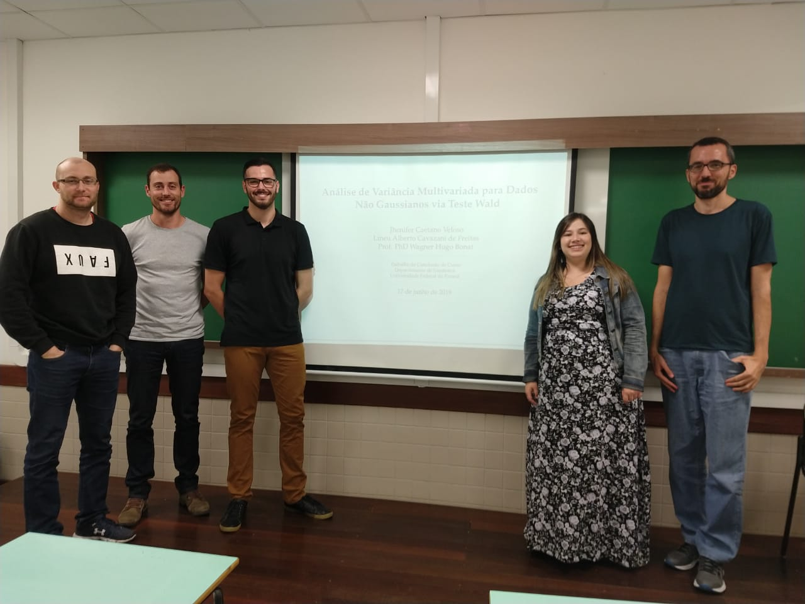

---

 

 [Lineu Alberto Cavazani de Freitas](https://lineu96.github.io/st/) 

 

---

Esta página tem como objetivo hospedar o material referente ao trabalho que desenvolvo no mestrado sob a orientação do professor [Wagner Hugo Bonat](http://www.leg.ufpr.br/~wagner/) e co-orientação do professor [Marco Antonio Zanata Alves](https://web.inf.ufpr.br/mazalves/) no [Programa de Pós Graduação em Informática](http://www.prppg.ufpr.br/ppginformatica/?lang=pb) da Universidade Federal do Paraná. O trabalho está inserido na área de concentração de Ciência da Computação, linha de pesquisa [Tecnologia da Informação](http://www.prppg.ufpr.br/ppginformatica/index.php/tecnologia-da informacao/?lang=pb) e grupo de pesquisa [Data Science & Big Data](https://web.inf.ufpr.br/dsbd/). 

---

Nosso interesse é desenvolver um ambiente para realização de testes de hipótese gerais sobre parâmetros de regressão, dispersão e potência além de desenvolver procedimentos para Análises de Variância Multivariadas no contexto dos Modelos Multivariados de Covariância Linear Generalizada. O comportamento dos testes e procedimentos propostos serão verificados através de estudos de simulação e serão aplicados a estudos de caso.

---

Este projeto teve início em 2018 quando eu e uma colega de curso (Jhenifer Caetano Veloso), desenvolvemos nosso Trabalho de Conclusão de Curso da graduação em Estatística na Universidade Federal do Paraná sob orientação do professor Wagner. No TCC estudamos o teste Wald para Análise de Variância Multivariada para dados não gaussianos.

Materiais desenvolvidos na graduação:

 - [Texto](https://lineu96.github.io/st/img/proj_manova/tcc.pdf)
 
 - [Apresentação](https://lineu96.github.io/st/img/proj_manova/apresentacao.pdf)
 

<td>  </td>

---

`Foto da apresentação do TCC. Da esquerda para a direita:` 

`Prof. Wagner Bonat (orientador), Prof. Walmes Zeviani (banca),`

`Lineu Alberto, Jhenifer Veloso, Prof. Cesar Taconeli (banca).`

---

<table><tr>
<td>  </td>
<td> &nbsp; &nbsp; &nbsp; &nbsp; &nbsp; &nbsp; </td>
<td>  </td>
<td> &nbsp; &nbsp; &nbsp; &nbsp; &nbsp; &nbsp; </td>

